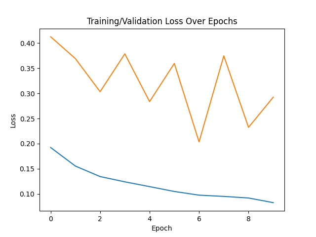

## Experiment 1
### Method: 
Using different percentage values for random points in mask annotation.

    - 10%, 30%, 70% and 100%

### Purpose: 
Logically having more points should lead to better results, I want to check if this is really true, and also how much very low quantity of points influence in the model training. 

### Experimental process: 
Using a bash script to change the values by argument parsing in the python main runner.

# Results: 

#### Loss curve

Looking at the training curves we can observe a lot of disturbance during the training, my guess is that the model I used may be a bit overkill for this dataset. Maybe some fine-tuning could improve the performance. 

But still, both validation and train losses are decreasing, seems like the model is generalizing well. 

    - 10% 
    
    - 30% 
    
    - 70% 
    
    - 100% 
    

#### Stats 

| Percentage | Loss    | IoU    | 
| :---:   | :---: | :---: | 
| 10%  | 0.2156   | -   |  
| 30% | 0.2040   | -   |
| 70% | 0.2041   | -   | 
| 100% | 0.2034   | -   | 

#### Conclusion

As expected, having a more complete mask (more annotations) resulted in better performance of the model. 

What really catched my attention was that there was a really small difference in the loss from 30% to 70%. 

Each run took about ~20min to run in my machine (3060 6GB). 

